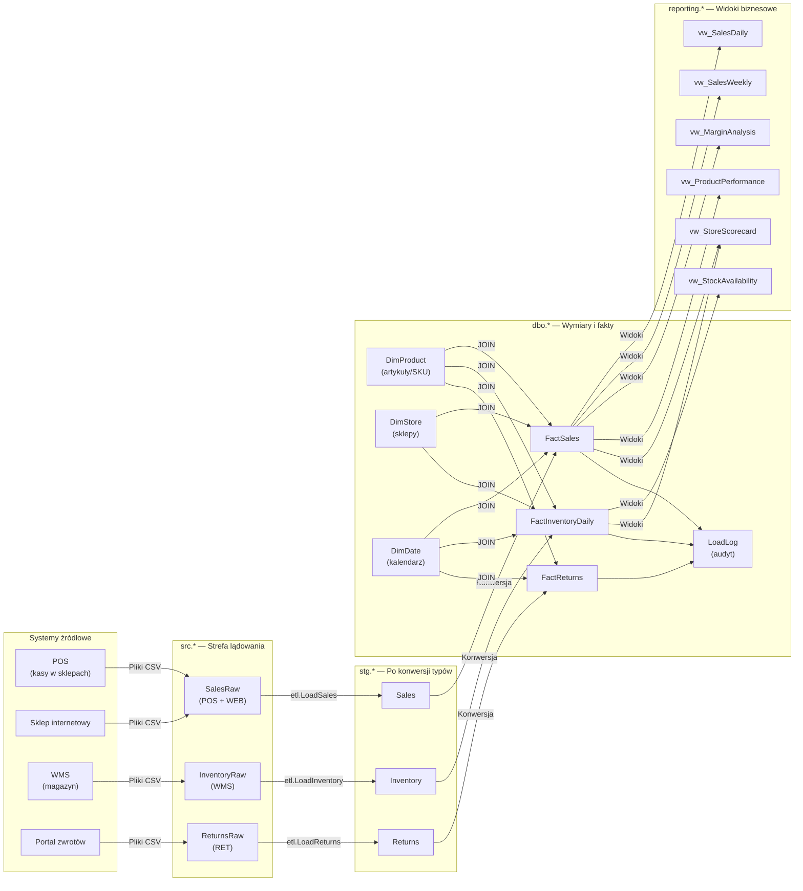
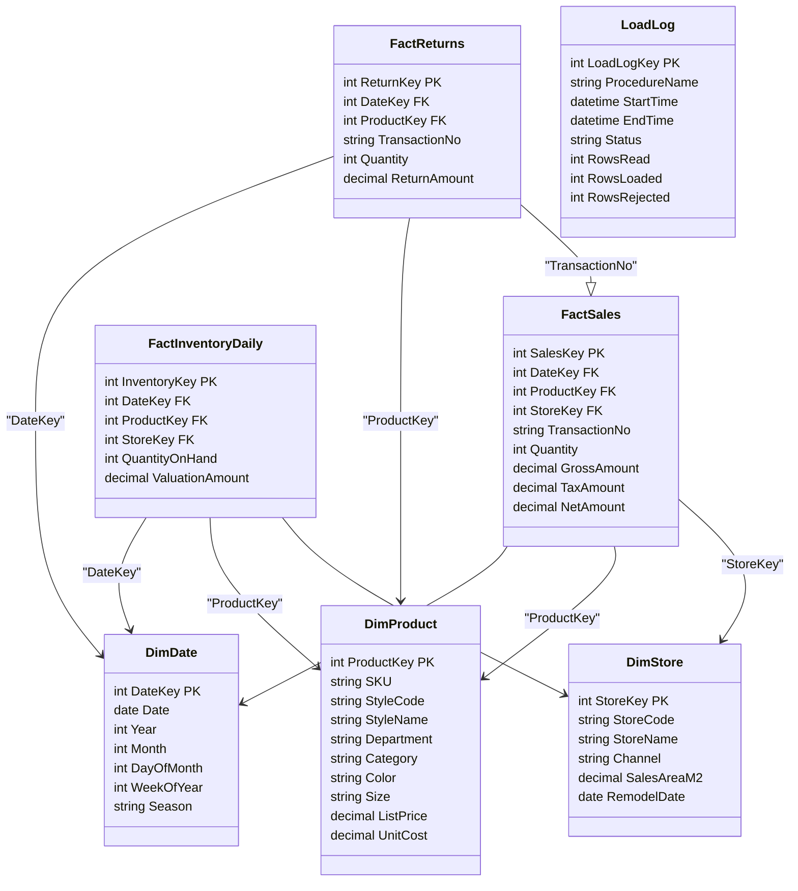

<!-- Generated by SpecStory, Markdown v2.1.0 -->

# 2026-09-22 06:30:53Z

<!-- VS Code Copilot IDE Session f06c001e-7b53-4977-8215-589b486dd216 (2026-09-22 06:30:53Z) -->

_**User (2026-09-22 06:30:53Z)**_

Opisz mi ten projekt: czym się zajmuje firma, jaki jest model danych i skąd
biorą się dane w hurtowni.


---

_**Agent (anthropic/Anthropic/claude-haiku-4-5-20251001)**_

Przeczytam dokumentację projektu, aby dać Ci pełny opis.

_**Agent (anthropic/Anthropic/claude-haiku-4-5-20251001)**_

<tool-use data-tool-type="read" data-tool-name="read_file"><details>
<summary>Tool use: **read_file**</summary>

Read `zrodla-danych.md`

**Input:**

- endLine: `200`
- filePath: `c:\Users\teamsharq\infoshare-silkycoders-sql-ai-2\docs\zrodla-danych.md`
- startLine: `1`

**Result:**

```
# Źródła danych

Wszystkie systemy źródłowe wystawiają pliki raz na dobę. Pliki lądują w
schemacie `src` w postaci, w jakiej przyszły — bez żadnej walidacji.

| System | Co wystawia | Nazwa pliku | Tabela |
| --- | --- | --- | --- |
| POS (kasy w sklepach) | pozycje paragonów ze sklepów stacjonarnych | `POS_yyyymmdd.csv` | `src.SalesRaw` |
| Sklep internetowy | pozycje zamówień online | `WEB_yyyymmdd.csv` | `src.SalesRaw` |
| WMS (magazyn) | stany na koniec dnia, osobny plik na dzień | `WMS_yyyymmdd.csv` | `src.InventoryRaw` |
| Portal zwrotów | przyjęte zwroty | `RET_yyyymm.csv` | `src.ReturnsRaw` |

Kolumna `SourceFile` w każdej tabeli `src.*` mówi, z którego pliku pochodzi
wiersz. `ExtractedAt` to moment wczytania pliku do strefy lądowania.

## Jak działa ładowanie

Każda z procedur `etl.LoadSales`, `etl.LoadInventory`, `etl.LoadReturns`
wykonuje dokładnie dwa kroki:

1. `src.*` → `stg.*` — konwersja typów. Wiersz, którego nie da się przekonwertować
   (data, liczba), jest pomijany.
2. `stg.*` → `dbo.Fact*` — podpięcie kluczy wymiarów i wyliczenie miar.

To **pełne przeładowanie**: obie tabele docelowe są najpierw czyszczone, więc
hurtownia zawsze odzwierciedla bieżącą zawartość strefy lądowania.

Przebieg każdego ładowania jest zapisywany w `dbo.LoadLog` — nazwa procedury,
czas, status oraz liczba wierszy odczytanych i załadowanych.

## Czego nie ma w hurtowni

- Dostaw i przesunięć międzysklepowych — mamy tylko stan wynikowy w migawce.
- Danych klienta — sprzedaż nie jest powiązana z osobą kupującą.
- Ruchu na stronie i lejka e-commerce.
```
</details></tool-use>

_**Agent (anthropic/Anthropic/claude-haiku-4-5-20251001)**_

<tool-use data-tool-type="read" data-tool-name="read_file"><details>
<summary>Tool use: **read_file**</summary>

Read `model-danych.md`

**Input:**

- endLine: `200`
- filePath: `c:\Users\teamsharq\infoshare-silkycoders-sql-ai-2\docs\model-danych.md`
- startLine: `1`

**Result:**

````
# Model danych

Hurtownia `RetailDW` ma cztery warstwy. Dane płyną zawsze w jedną stronę.

```
src.*          →     stg.*        →      dbo.*          →   reporting.*
strefa            dane po              wymiary i            widoki
lądowania         konwersji            fakty                raportowe
```

| Schemat | Do czego służy |
| --- | --- |
| `src` | To, co przysłał system źródłowy — wszystkie kolumny tekstowe, nic nie jest sprawdzane |
| `stg` | Te same dane po konwersji na właściwe typy; wiersze nieprzekształcalne nie trafiają tutaj |
| `dbo` | Wymiary i tabele faktów — właściwa hurtownia |
| `reporting` | Widoki, z których korzysta biznes |
| `etl` | Procedury ładujące |

## Wymiary

**`dbo.DimProduct`** — jeden wiersz na SKU. W odzieży SKU to konkretny wariant
rozmiarowo-kolorystyczny modelu, np. `W-JKT-001-CZA-M`.

- `StyleCode` / `StyleName` — model, np. `W-JKT-001`, „Kurtka pikowana damska”
- `Department` — `WOMEN`, `MEN`, `UNISEX`
- `Category` — Kurtki, Sukienki, Swetry, Jeansy, T-shirty, Koszule, Akcesoria
- `Color`, `Size` — rozmiary `XS`–`XL`, akcesoria mają `ONE`
- `ListPrice` (cena katalogowa z VAT), `UnitCost` (koszt jednostkowy)

Analiza „po modelu” to grupowanie po `StyleCode`, „po produkcie” zwykle po `SKU`.

**`dbo.DimStore`** — pięć sklepów stacjonarnych i sklep internetowy.

- `Channel` — `STORE` albo `ONLINE`
- `SalesAreaM2` — powierzchnia sprzedaży, `NULL` dla sklepu internetowego
- `RemodelDate` — data ostatniej zmiany powierzchni

**`dbo.DimDate`** — kalendarz z tygodniem ISO, miesiącem i sezonem.

## Fakty

| Tabela | Ziarno | Uwaga |
| --- | --- | --- |
| `dbo.FactSales` | jedna pozycja paragonu | `TransactionNo` powtarza się w obrębie paragonu |
| `dbo.FactInventoryDaily` | dzień × SKU × sklep | **migawka** stanu na koniec dnia, nie log ruchów |
| `dbo.FactReturns` | jedna zwrócona pozycja | `ReturnAmount` dodatni, z VAT |

`FactInventoryDaily` obejmuje tylko bieżący sezon — dla wcześ
… (output truncated)
````
</details></tool-use>

_**Agent (anthropic/Anthropic/claude-haiku-4-5-20251001)**_

## Opis projektu RetailDW

### Firma: Nordvik

**Nordvik** to sieć odzieżowa z pięcioma sklepami stacjonarnymi i sklepem internetowym. Sprzedaje odzież damską, męską i uniseksową — głównie kurtki, sukienki, swetry, jeansy, T-shirty, koszule i akcesoria.

---

### Model danych

Hurtownia ma **cztery warstwy**, przez które dane płyną w jednym kierunku:

```
src.* → stg.* → dbo.* → reporting.*
```

**Warstwy:**

| Warstwa | Zawartość |
|---------|-----------|
| **src*** | Surowe dane z systemów źródłowych — wszystkie kolumny tekstowe, nic nie sprawdzane |
| **stg*** | Te same dane po konwersji na właściwe typy; wiersze nieprzekształcalne są pominięte |
| **dbo*** | Wymiary i tabele faktów — właściwa hurtownia |
| **reporting*** | Widoki gotowe dla biznesu |
| **etl** | Procedury ładujące |

**Wymiary:**

1. **`dbo.DimProduct`** — artykuły (SKU). Każdy SKU to konkretny wariant rozmiarowo-kolorystyczny, np. `W-JKT-001-CZA-M` (kurtka pikowana damska, czarna, rozmiar M).
   - Dane: StyleCode, StyleName, Department, Category, Color, Size, ListPrice, UnitCost

2. **`dbo.DimStore`** — pięć sklepów stacjonarnych + sklep internetowy.
   - Dane: Channel (STORE/ONLINE), powierzchnia sprzedaży, data ostatniej zmiany

3. **`dbo.DimDate`** — kalendarz z tygodniem ISO, miesiącem i sezonem.

**Tabele faktów:**

| Tabela | Ziarno | Opis |
|--------|--------|------|
| **`dbo.FactSales`** | Jedna pozycja paragonu | Sprzedaż ze sklepów (POS) i sklepu internetowego (WEB) |
| 

## Opis projektu RetailDW

### Firma: Nordvik

**Nordvik** to sieć odzieżowa z pięcioma sklepami stacjonarnymi i sklepem internetowym. Sprzedaje odzież damską, męską i uniseksową — głównie kurtki, sukienki, swetry, jeansy, T-shirty, koszule i akcesoria.

---

### Model danych

Hurtownia ma **cztery warstwy**, przez które dane płyną w jednym kierunku:

```
src.* → stg.* → dbo.* → reporting.*
```

**Warstwy:**

| Warstwa | Zawartość |
|---------|-----------|
| **src*** | Surowe dane z systemów źródłowych — wszystkie kolumny tekstowe, nic nie sprawdzane |
| **stg*** | Te same dane po konwersji na właściwe typy; wiersze nieprzekształcalne są pominięte |
| **dbo*** | Wymiary i tabele faktów — właściwa hurtownia |
| **reporting*** | Widoki gotowe dla biznesu |
| **etl** | Procedury ładujące |

**Wymiary:**

1. **`dbo.DimProduct`** — artykuły (SKU). Każdy SKU to konkretny wariant rozmiarowo-kolorystyczny, np. `W-JKT-001-CZA-M` (kurtka pikowana damska, czarna, rozmiar M).
   - Dane: StyleCode, StyleName, Department, Category, Color, Size, ListPrice, UnitCost

2. **`dbo.DimStore`** — pięć sklepów stacjonarnych + sklep internetowy.
   - Dane: Channel (STORE/ONLINE), powierzchnia sprzedaży, data ostatniej zmiany

3. **`dbo.DimDate`** — kalendarz z tygodniem ISO, miesiącem i sezonem.

**Tabele faktów:**

| Tabela | Ziarno | Opis |
|--------|--------|------|
| **`dbo.FactSales`** | Jedna pozycja paragonu | Sprzedaż ze sklepów (POS) i sklepu internetowego (WEB) |
| **`dbo.FactInventoryDaily`** | Dzień × SKU × sklep | Migawka stanu na koniec dnia (tylko sezon bieżący) |
| **`dbo.FactReturns`** | Jedna zwrócona pozycja | Zwroty zaakceptowane, kwota dodatnia |

---

### Źródła danych

Wszystkie systemy źródłowe wysyłają dane raz dziennie (zwroty raz miesięcznie) w plikach CSV:

| System | Co wysyła | Plik | Docelowa tabela |
|--------|-----------|------|-----------------|
| **POS** (kasy w sklepach) | Pozycje paragonów | `POS_yyyymmdd.csv` | `src.SalesRaw` |
| **Sklep internetowy** | Pozycje zamówień | `WEB_yyyymmdd.csv` | `src.SalesRaw` |
| **WMS** (magazyn) | Stany na koniec dnia | `WMS_yyyymmdd.csv` | `src.InventoryRaw` |
| **Portal zwrotów** | Zwroty | `RET_yyyymm.csv` | `src.ReturnsRaw` |

**Proces ładowania:**

1. Plik ląduje w `src.*` bez żadnej walidacji.
2. Procedura `etl.Load*` konwertuje typ: `src.* → stg.*` (wiersze niepoprawne są odrzucane).
3. Dołącza klucze wymiarów i liczy miary: `stg.* → dbo.Fact*` (pełne przeładowanie).
4. Przebieg zapisywany w `dbo.LoadLog` (liczba wierszy, status, czas).

**Ograniczenia:**

- Dane o dostaw i przesunięciach międzysklepowych nie są widoczne — tylko stany wynikowe w migawce.
- Brak danych klienta — sprzedaż nie wiąże się z osobą.
- Brak ruchu na stronie internetowej.
- `FactInventoryDaily` zawiera tylko bieżący sezon.

---

_**User (2026-09-22 06:34:08Z)**_

mermaid diagram

---

_**User (2026-09-22 06:35:04Z)**_

@agent Try Again

---

_**User (2026-09-22 06:35:19Z)**_

@agent Try Again

---

_**User (2026-09-22 06:35:27Z)**_

@agent Try Again

---

_**User (2026-09-22 06:35:49Z)**_

@agent Try Again

---

_**Agent (anthropic/Anthropic/claude-haiku-4-5-20251001)**_



Diagram pokazuje:

- **Źródła** — cztery systemy zewnętrzne wysyłające pliki CSV
- **src.*** — surowe dane lądujące z systemów
- **stg.*** — dane po konwersji typów (wiersza nieprzetwarzalne odrzucone)
- **dbo.*** — wymiary (Product, Store, Date), tabele faktów (Sales, Inventory, Returns) i audyt (LoadLog)
- **reporting.*** — sześć widoków gotowych dla biznesu
- **Przepływ** — dane płyną zawsze w jednym kierunku, procedury `etl.Load*` nadzorują konwersję

---

_**User (2026-09-22 06:38:42Z)**_

create uml diagram

---

_**Agent (anthropic/Anthropic/claude-haiku-4-5-20251001)**_



Diagram UML pokazuje:

**Wymiary:**
- **DimDate** — data, rok, miesiąc, tydzień ISO, sezon
- **DimProduct** — artykuł (SKU), model, dział, kategoria, rozmiar, kolor, cena, koszt
- **DimStore** — sklep, kanał (STORE/ONLINE), powierzchnia, data remontu

**Tabele faktów:**
- **FactSales** — jedna pozycja paragonu (ilość, kwota brutto/netto)
- **FactInventoryDaily** — stan na koniec dnia × SKU × sklep
- **FactReturns** — zwrócona pozycja, powiązana ze sprzedażą przez `TransactionNo`

**Audyt:**
- **LoadLog** — przebieg każdego ładowania (liczba wierszy, status, czas)

**Relacje:**
- Wszystkie fakty łączą się z wymiarami po kluczach surogatowych
- Zwroty powiązane ze sprzedażą przez `TransactionNo`

---

_**User (2026-09-22 06:39:37Z)**_

save as img to docs

---

_**Agent (anthropic/Anthropic/claude-haiku-4-5-20251001)**_

<tool-use data-tool-type="generic" data-tool-name="open_browser_page"><details>
<summary>Tool use: **open_browser_page**</summary>

Opened browser page at https://mermaid.live/

**Input:**

- url: `https://mermaid.live`

**Result:**

```
The user chose to skip the tool call, they want to proceed without running it
```
</details></tool-use>

_**Agent (anthropic/Anthropic/claude-haiku-4-5-20251001)**_

Spróbuję konwertować diagram za pomocą CLI mermaid. Najpierw sprawdzę, czy jest zainstalowany:

_**Agent (anthropic/Anthropic/claude-haiku-4-5-20251001)**_

<tool-use data-tool-type="generic" data-tool-name="run_in_terminal"><details>
<summary>Tool use: **run_in_terminal**</summary>

Running ` which mmdc || npm list -g @mermaid-js/mermaid-cli`

Sprawdzenie dostępności narzędzia mermaid-cli

```bash
which mmdc || npm list -g @mermaid-js/mermaid-cli
```

**Result:**

```
The user cancelled the tool call.
```
</details></tool-use>

---

_**User (2026-09-22 06:40:00Z)**_

can i save it from vs code?

---

_**Agent (anthropic/Anthropic/claude-haiku-4-5-20251001)**_

Tak, masz kilka opcji:

**Opcja 1: Mermaid extension w VS Code**
- Zainstaluj rozszerzenie „Mermaid" lub „Markdown Preview Mermaid Support"
- W pliku markdown z kodem mermaid kliknij prawym przyciskiem na diagram → Export → PNG/SVG

**Opcja 2: Utworzyć plik markdown w docs/**
Mogę zapisać diagramy jako markdown w `docs` — wtedy będą widoczne w dokumentacji:

- `docs/model-danych-diagram.md` (UML)
- `docs/data-flow-diagram.md` (przepływ danych)

Które podejście preferujesz? Czy masz już zainstalowane rozszerzenie mermaid w VS Code?

---

_**User (2026-09-22 06:40:55Z)**_

save diagram to docs

---

_**Agent (anthropic/Anthropic/claude-haiku-4-5-20251001)**_

<tool-use data-tool-type="write" data-tool-name="create_file"><details>
<summary>Tool use: **create_file**</summary>

Created `data-flow-diagram.md`

**Input:**

- content:

````
# Diagram przepływu danych


Diagram pokazuje przepływ danych od systemów źródłowych przez poszczególne warstwy hurtowni do widoków biznesowych.

````

- filePath: `c:\Users\teamsharq\infoshare-silkycoders-sql-ai-2\docs\data-flow-diagram.md`

**Result:**

```
The following files were successfully edited:
c:\Users\teamsharq\infoshare-silkycoders-sql-ai-2\docs\data-flow-diagram.md
```
</details></tool-use>

_**Agent (anthropic/Anthropic/claude-haiku-4-5-20251001)**_

<tool-use data-tool-type="write" data-tool-name="textEditGroup"><details>
<summary>Edit: **data-flow-diagram.md**</summary>

@@ lines 1-1 @@

````
# Diagram przepływu danych


Diagram pokazuje przepływ danych od systemów źródłowych przez poszczególne warstwy hurtowni do widoków biznesowych.

````
</details></tool-use>

_**Agent (anthropic/Anthropic/claude-haiku-4-5-20251001)**_

<tool-use data-tool-type="write" data-tool-name="create_file"><details>
<summary>Tool use: **create_file**</summary>

Created `model-uml.md`

**Input:**

- content:

````
# Model danych — Diagram UML


## Wymiary

- **DimDate** — data, rok, miesiąc, tydzień ISO, sezon
- **DimProduct** — artykuł (SKU), model, dział, kategoria, rozmiar, kolor, cena, koszt
- **DimStore** — sklep, kanał (STORE/ONLINE), powierzchnia, data remontu

## Tabele faktów

- **FactSales** — jedna pozycja paragonu (ilość, kwota brutto/netto)
- **FactInventoryDaily** — stan na koniec dnia × SKU × sklep
- **FactReturns** — zwrócona pozycja, powiązana ze sprzedażą przez `TransactionNo`

## Audyt

- **LoadLog** — przebieg każdego ładowania (liczba wierszy, status, czas)

## Relacje

- Wszystkie fakty łączą się z wymiarami po kluczach surogatowych
- Zwroty powiązane ze sprzedażą przez `TransactionNo`

````

- filePath: `c:\Users\teamsharq\infoshare-silkycoders-sql-ai-2\docs\model-uml.md`

**Result:**

```
The following files were successfully edited:
c:\Users\teamsharq\infoshare-silkycoders-sql-ai-2\docs\model-uml.md
```
</details></tool-use>

_**Agent (anthropic/Anthropic/claude-haiku-4-5-20251001)**_

<tool-use data-tool-type="write" data-tool-name="textEditGroup"><details>
<summary>Edit: **model-uml.md**</summary>

@@ lines 1-1 @@

````
# Model danych — Diagram UML


## Wymiary

- **DimDate** — data, rok, miesiąc, tydzień ISO, sezon
- **DimProduct** — artykuł (SKU), model, dział, kategoria, rozmiar, kolor, cena, koszt
- **DimStore** — sklep, kanał (STORE/ONLINE), powierzchnia, data remontu

## Tabele faktów

- **FactSales** — jedna pozycja paragonu (ilość, kwota brutto/netto)
- **FactInventoryDaily** — stan na koniec dnia × SKU × sklep
- **FactReturns** — zwrócona pozycja, powiązana ze sprzedażą przez `TransactionNo`

## Audyt

- **LoadLog** — przebieg każdego ładowania (liczba wierszy, status, czas)

## Relacje

- Wszystkie fakty łączą się z wymiarami po kluczach surogatowych
- Zwroty powiązane ze sprzedażą przez `TransactionNo`

````
</details></tool-use>

_**Agent (anthropic/Anthropic/claude-haiku-4-5-20251001)**_

Gotowe! Zapisałem oba diagramy jako markdown w `docs`:

1. `docs/data-flow-diagram.md` — przepływ danych przez warstwy hurtowni
2. `docs/model-uml.md` — strukturę wymiarów i faktów

Możesz je teraz:
- **Przeglądać** w VS Code (jeśli masz rozszerzenie Mermaid)
- **Wyeksportować jako PNG/SVG** — prawy przycisk na diagram w previewie → Export
- **Umieścić w dokumentacji projektu**

Aby wyeksportować z CLI, możesz zainstalować:
```bash
npm install -g @mermaid-js/mermaid-cli
```

A potem:
```bash
mmdc -i docs/data-flow-diagram.md -o docs/data-flow-diagram.png
mmdc -i docs/model-uml.md -o docs/model-uml.png
```
