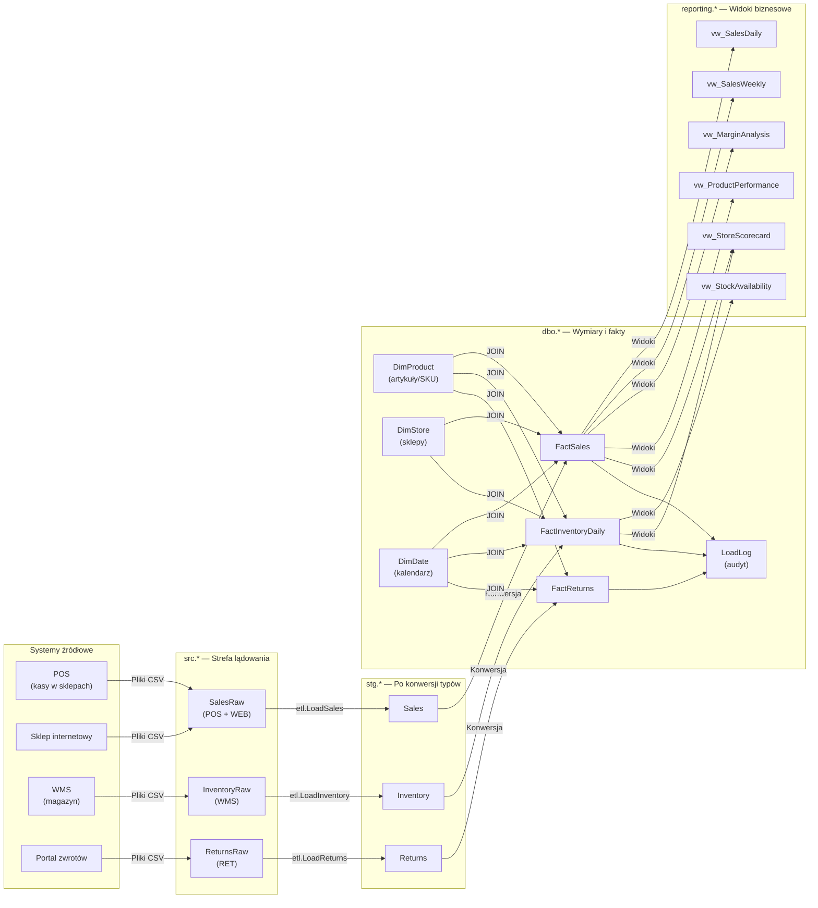

# Diagram przepływu danych

```mermaid
graph LR
    subgraph Sources["Systemy źródłowe"]
        POS["POS<br/>(kasy w sklepach)"]
        WEB["Sklep internetowy"]
        WMS["WMS<br/>(magazyn)"]
        RET["Portal zwrotów"]
    end
    
    subgraph SRC["src.* — Strefa lądowania"]
        SalesRaw["SalesRaw<br/>(POS + WEB)"]
        InventoryRaw["InventoryRaw<br/>(WMS)"]
        ReturnsRaw["ReturnsRaw<br/>(RET)"]
    end
    
    subgraph STG["stg.* — Po konwersji typów"]
        Sales["Sales"]
        Inventory["Inventory"]
        Returns["Returns"]
    end
    
    subgraph DBO["dbo.* — Wymiary i fakty"]
        DimProduct["DimProduct<br/>(artykuły/SKU)"]
        DimStore["DimStore<br/>(sklepy)"]
        DimDate["DimDate<br/>(kalendarz)"]
        FactSales["FactSales"]
        FactInventory["FactInventoryDaily"]
        FactReturns["FactReturns"]
        LoadLog["LoadLog<br/>(audyt)"]
    end
    
    subgraph RPT["reporting.* — Widoki biznesowe"]
        vwSalesDaily["vw_SalesDaily"]
        vwSalesWeekly["vw_SalesWeekly"]
        vwMarginAnalysis["vw_MarginAnalysis"]
        vwProductPerformance["vw_ProductPerformance"]
        vwStockAvailability["vw_StockAvailability"]
        vwStoreScorecard["vw_StoreScorecard"]
    end
    
    POS -->|Pliki CSV| SalesRaw
    WEB -->|Pliki CSV| SalesRaw
    WMS -->|Pliki CSV| InventoryRaw
    RET -->|Pliki CSV| ReturnsRaw
    
    SalesRaw -->|etl.LoadSales| Sales
    InventoryRaw -->|etl.LoadInventory| Inventory
    ReturnsRaw -->|etl.LoadReturns| Returns
    
    Sales -->|Konwersja| FactSales
    Inventory -->|Konwersja| FactInventory
    Returns -->|Konwersja| FactReturns
    
    DimProduct -->|JOIN| FactSales
    DimStore -->|JOIN| FactSales
    DimDate -->|JOIN| FactSales
    
    DimProduct -->|JOIN| FactInventory
    DimStore -->|JOIN| FactInventory
    DimDate -->|JOIN| FactInventory
    
    DimProduct -->|JOIN| FactReturns
    DimDate -->|JOIN| FactReturns
    
    FactSales -->|Widoki| vwSalesDaily
    FactSales -->|Widoki| vwSalesWeekly
    FactSales -->|Widoki| vwMarginAnalysis
    FactSales -->|Widoki| vwProductPerformance
    FactInventory -->|Widoki| vwStockAvailability
    FactSales -->|Widoki| vwStoreScorecard
    FactInventory -->|Widoki| vwStoreScorecard
    
    FactSales --> LoadLog
    FactInventory --> LoadLog
    FactReturns --> LoadLog
```

Diagram pokazuje przepływ danych od systemów źródłowych przez poszczególne warstwy hurtowni do widoków biznesowych.
