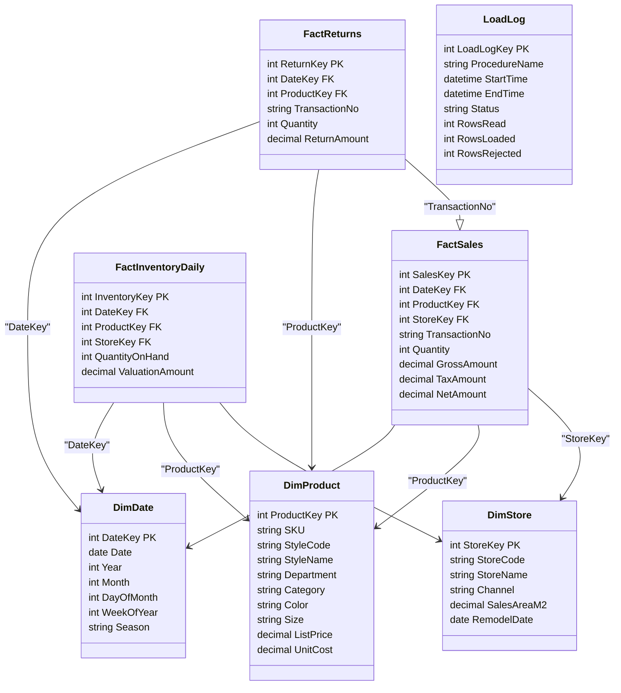

# Model danych — Diagram UML

## Wymiary

- **DimDate** — data, rok, miesiąc, tydzień ISO, sezon
- **DimProduct** — artykuł (SKU), model, dział, kategoria, rozmiar, kolor, cena, koszt
- **DimStore** — sklep, kanał (STORE/ONLINE), powierzchnia, data remontu

## Tabele faktów

- **FactSales** — jedna pozycja paragonu (ilość, kwota brutto/netto)
- **FactInventoryDaily** — stan na koniec dnia × SKU × sklep
- **FactReturns** — zwrócona pozycja, powiązana ze sprzedażą przez `TransactionNo`

## Audyt

- **LoadLog** — przebieg każdego ładowania (liczba wierszy, status, czas)

## Relacje

- Wszystkie fakty łączą się z wymiarami po kluczach surogatowych
- Zwroty powiązane ze sprzedażą przez `TransactionNo`
